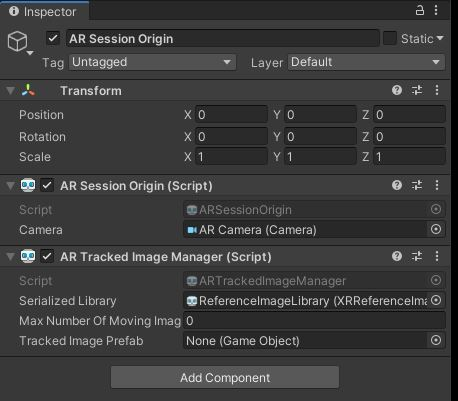
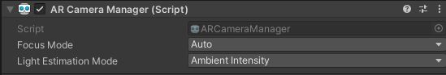

# ARFoundation-Unity-Experiments
Experiments made using Unity and AR Foundation. Deployed in Android.

# Setup

Create a new project in Unity and select the 3D Template. I am using version `2019.3.3f1`

Open the package manager and install `AR Foundation`, `AR Subsystems` and the `ARCore XR` plugin. If you are using an Iphone/Ipad, also install the `ARKit XR` Plugin.

`ARFoundation` is built on "subsystems" and depends on a separate package called ARSubsystems. `ARSubsystems` defines an interface, and the platform-specific implementations are in the ARCore and ARKit packages. ARFoundation turns the AR data provided by ARSubsystems into Unity GameObjects and MonoBehavours.([source](https://github.com/Unity-Technologies/arfoundation-samples))

Create a ReferenceImageLibrary found in the create>XR>Reference Image Library. You can access this menu by right clicking on the project area.

Check specify size and give it the values of the object in the real world. Add it to the reference manger.

Add an `AR Tracked Image Manager` component to your `AR Session Origin` object in your hierarchy. Add your `ReferenceImageLibrary` you created to the `Serialized Library` field in the component.

## Android Player Settings 

- Disable Vulkan
- Set minimum API level to 24 (Android Nougat version 7.0)

Add a AR Camera Manager Component, and set the focus mode to 'auto'.

#### Random

Differences

- Monobehavior

- It's a script.
- It receives Unity Callbacks, like start(),update(),ontriggerenter(), etc...
- At runtime it is attached to GameObjects
- The Data is saved into scenes and prefabs

- Scriptable Objects
  
- It's a script
- Only has a few callbacks
- onEnable(), onDestroy(), etc....
- not attached to any GameObject
- not saved in scenes and presets, saved as an .asset file

